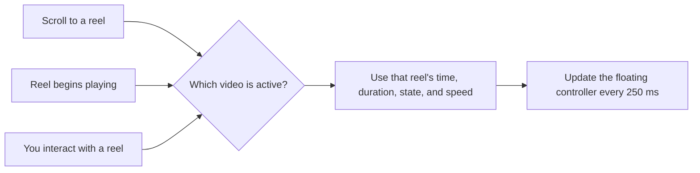

<div align="center">

# Instagram Reels Extended Controls

<a href="#install-in-less-than-two-minutes"></a>
<a href="#features"></a>
<a href="LICENSE"></a>


**A clean, draggable control panel for Instagram Reels.**  
No clutter. No emoji buttons. Just the controls that are useful.

</div>

---

## What it does

Instagram Clean Reel Controls hides the browser’s default video-control bar and adds one polished floating controller that follows the active reel as you browse.

```text
┌───────────────────────────────────────────────┐
│ REEL CONTROLS                     0:08 / 0:54 │  ← drag here
│ ━━━━━━━━━━━━━━━●━━━━━━━━━━━━━━━━━━━━━━━━━━━━  │  ← seek anywhere
│ [ Back 5s ] [ − ] [ Pause ] [ + ] [ Ahead 5s ]│
│          [ Speed 1.00x ] [ Copy link ]        │      
└───────────────────────────────────────────────┘
```

## Features

| Feature | Why it is useful |
| --- | --- |
| **Active-reel sync** | The panel follows the reel that is playing or most visible after you scroll. |
| **Timeline + timestamp** | See the current time and duration; drag the scrubber to seek precisely. |
| **Quick navigation** | Jump backward or forward by 5 seconds. |
| **Speed control** | Change speed in 0.25× steps from 0.25× to 4×; your setting is remembered. |
| **Clean interface** | Removes the browser’s full native control bar and avoids decorative emoji controls. |
| **Draggable layout** | Drag the header to place the panel where it feels right. Its position is saved. |
| **Copy link** | Copy the clean URL of the open reel in one click. |

<details>
<summary><b>Keyboard shortcuts</b></summary>

<br>

| Key | Action |
| --- | --- |
| <kbd>[</kbd> | Slow down by 0.25× |
| <kbd>]</kbd> | Speed up by 0.25× |
| <kbd>\</kbd> | Reset to 1.00× |

</details>

---

## Install in less than two minutes

> [!IMPORTANT]
> A userscript manager is required. It runs this script locally in your browser—nothing is uploaded from this script.

<details open>
<summary><b>Chrome — free with Tampermonkey</b></summary>

<br>

1. Install **[Tampermonkey from the Chrome Web Store](https://chromewebstore.google.com/detail/tampermonkey/dhdgffkkebhmkfjojejmpbldmpobfkfo)**.
2. Click the Tampermonkey icon in Chrome’s toolbar, then select **Create a new script**.
3. Select all of the starter code in the editor and delete it.
4. Open [`instagram-enhanced-video-controls.user.js`](./instagram-enhanced-video-controls.user.js) in this repository, copy everything, and paste it into the editor.
5. Press <kbd>Ctrl</kbd> + <kbd>S</kbd> (Windows/Linux) or <kbd>⌘</kbd> + <kbd>S</kbd> (Mac) to save.
6. Open or refresh any Instagram reel at `instagram.com/reel/...`.

**First run:** if Tampermonkey asks for access, allow it on `instagram.com`. The floating panel appears at the lower-right of the page.

</details>

<details>
<summary><b>Safari — use the free <em>Userscripts</em> app</b></summary>

<br>

Tampermonkey for Safari may require a paid purchase. A straightforward free alternative is **[Userscripts](https://apps.apple.com/app/userscripts/id1463298887)**, an open-source Safari extension for running JavaScript and CSS on chosen websites.

1. Install **Userscripts** from the Mac App Store and open the app once.
2. In Safari, go to **Safari → Settings → Extensions**.
3. Turn on **Userscripts**. When Safari asks, allow the extension to access `instagram.com` (or choose the broader website access option if you prefer).
4. Click the Userscripts toolbar icon, then open its extension page/editor.
5. Create a new JavaScript userscript. Give it a name such as **Instagram Clean Reel Controls**.
6. Copy the complete contents of [`instagram-enhanced-video-controls.user.js`](./instagram-enhanced-video-controls.user.js) and paste it into the editor.
7. Save the script and ensure it is enabled for Instagram.
8. Refresh Instagram and open a reel.

> [!TIP]
> Safari can ask for website access separately from enabling the extension. If the panel does not appear, revisit **Safari → Settings → Extensions → Userscripts**, check that it is enabled, and grant access to `instagram.com`, then reload the page.

</details>

---

## How the sync works



The script prefers the reel Instagram has started playing. During scroll transitions, it falls back to the video occupying the largest visible area, so the timestamp, seek bar, and buttons follow the reel in view.

## Using the panel

1. **Move it:** drag the `REEL CONTROLS` header.
2. **Seek:** drag or click along the blue timeline.
3. **Control playback:** use Play/Pause or jump back/ahead five seconds.
4. **Set speed:** use `−` / `+`; click **Speed** to switch between 1× and 1.5× quickly.
5. **Share:** click **Copy link** for the reel URL without tracking parameters.

## Troubleshooting

<details>
<summary><b>The panel does not appear</b></summary>

<br>

- Confirm the userscript manager and this script are both enabled.
- Refresh the Instagram tab after saving the script.
- Check that you are on an Instagram post, reel, or TV URL.
- In Safari, confirm the Userscripts extension has permission for `instagram.com`.

</details>

<details>
<summary><b>The controls follow the wrong reel</b></summary>

<br>

Click or start playback on the reel you want to control. The panel will use that reel immediately. When scrolling, pause briefly for Instagram to make the next reel active.

</details>

<details>
<summary><b>Instagram changed its player</b></summary>

<br>

Instagram frequently updates its web interface. Refresh first; if it persists, open an issue with your browser, operating system, and a short description of what changed.

</details>

---

## Privacy & permissions

- The script runs only on the Instagram URL patterns listed in its header.
- It does not send data to a server.
- `localStorage` is used only to remember panel position and playback speed.
- Your userscript manager needs website access solely to inject the script into Instagram.

## Disclaimer

This is an independent browser customization and is not affiliated with, endorsed by, or maintained by Instagram or Meta. Use it responsibly and follow Instagram’s terms of use.

---

<div align="center">

Made for calmer, more controllable reels.

</div>
